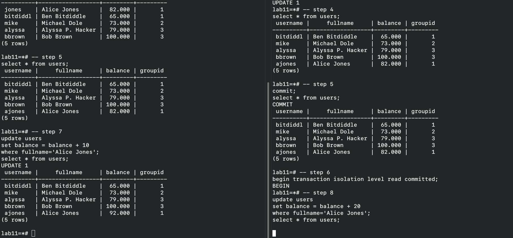
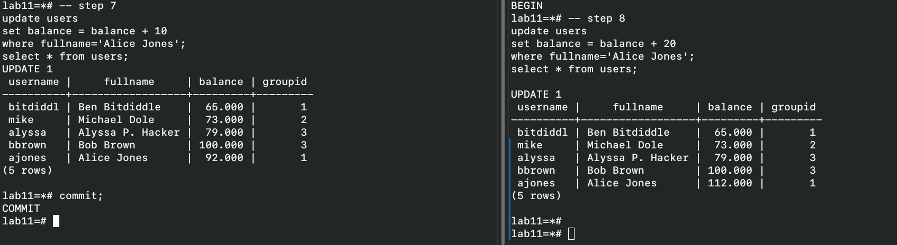
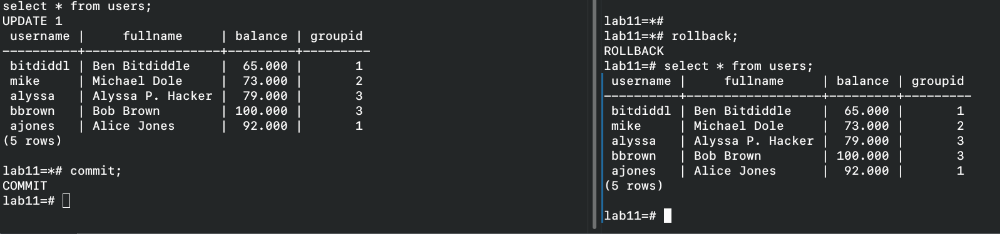

# Exercise 1

## Read committed

In read committed isolation level, only committed data can be read. 
Thus, in transaction 1 the username remains the same since it was changed in transaction not yet commited.
ex2a.png

The thing worth noticing is T2's behavior on step 8. Since the row was modified by T1's current uncommited transactions,

"If a target row found by a query while executing an UPDATE statement (or DELETE or SELECT FOR UPDATE) has already been updated by a concurrent uncommitted transaction then the second transaction that tries to update this row will wait for the other transaction to commit or rollback".
<https://www.postgresql.org/docs/7.2/xact-read-committed.html>

That is what we see here. 

If we commit in T1, the T2 gets awaken and proceeds to the transaction, updating the value updated by T1.

commit/rollback:

## Repeatable read

That isolation type is stronger than the previous one, and all the properties are preserved, that is, uncommited transaction changes are not visible to other transactions.

However, the important detail is:
"The Repeatable Read isolation level only sees data committed before the transaction began".
<https://www.postgresql.org/docs/current/transaction-iso.html>
The other interesting detail is revealed on updating the row that was modified by a concurrent transaction. Here, T2 modified and commited the changes for username of Alice concurrently with T1.

"...if the first updater commits (and actually updated or deleted the row, not just locked it) then the repeatable read transaction will be rolled back with the message
ERROR:  could not serialize access due to concurrent update
because a repeatable read transaction cannot modify or lock rows changed by other transactions after the repeatable read transaction began".
That is the reason for an error.

We can proceed by rolling back the T1.

# Exercise 2

## Read committed
Until commiting the changes, both transactions are completely unaware of changes of each other. Thus, T1 will only add 15 to Michael Dole, since it was not aware of T2 changing it.
Finally, after commiting the changes, for Bob the group is changed but the balance is not.

## Repeatable read

The situation is a bit more subtle here. Why don't we get an error? Well, both transactions explicitly don't use the same rows. Yes, the T2 changes groupId of Bob, but T1 doesn't refer to the Bob's record immediately. Thus, having its own snapshot of the table, it is again changing only the balance of Michael.

