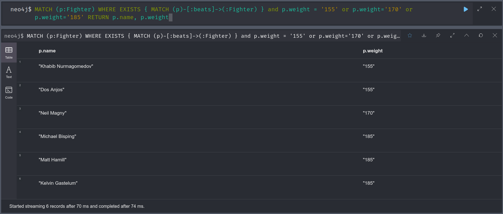
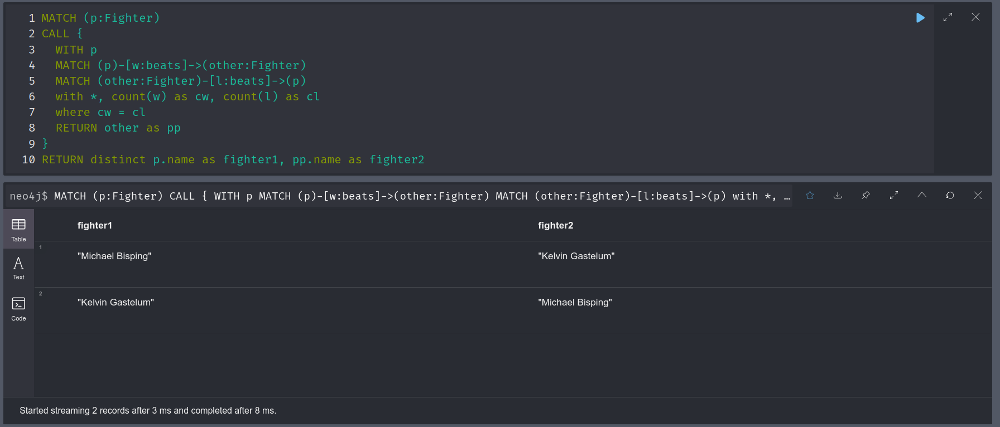
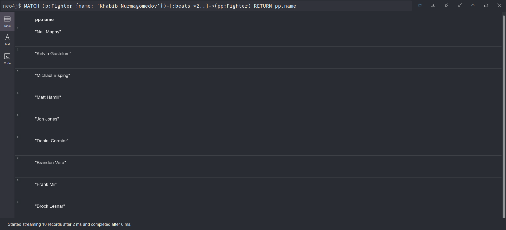
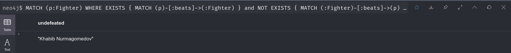
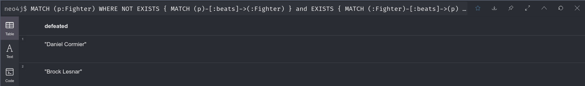
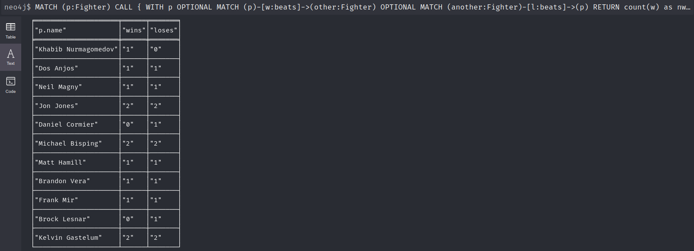

# Lab 12 exercise 1
## Create nodes

``` sql
create (p:Fighter {name:'Khabib Nurmagomedov', weight:'155'});
create (p:Fighter {name:'Dos Anjos', weight:'155'});
create (p:Fighter {name:'Neil Magny', weight:'170'});
create (p:Fighter {name:'Jon Jones', weight:'205'});
create (p:Fighter {name:'Daniel Cormier', weight:'205'});
create (p:Fighter {name:'Michael Bisping', weight:'185'});
create (p:Fighter {name:'Matt Hamill', weight:'185'});
create (p:Fighter {name:'Brandon Vera', weight:'205'});
create (p:Fighter {name:'Frank Mir', weight:'230'});
create (p:Fighter {name:'Brock Lesnar', weight:'230'});
create (p:Fighter {name:'Kelvin Gastelum', weight:'185'});
```

## Create relationships
``` sql
MATCH (p:Fighter{name:'Khabib Nurmagomedov'}), (pp:Fighter{name:'Dos Anjos'}) MERGE (p)-[:beats]->(pp)
MATCH (p:Fighter{name:'Dos Anjos'}), (pp:Fighter{name:'Neil Magny'}) MERGE (p)-[:beats]->(pp)
MATCH (p:Fighter{name:'Jon Jones'}), (pp:Fighter{name:'Daniel Cormier'}) MERGE (p)-[:beats]->(pp)
MATCH (p:Fighter{name:'Michael Bisping'}), (pp:Fighter{name:'Matt Hamill'}) MERGE (p)-[:beats]->(pp)
MATCH (p:Fighter{name:'Jon Jones'}), (pp:Fighter{name:'Brandon Vera'}) MERGE (p)-[:beats]->(pp)
MATCH (p:Fighter{name:'Brandon Vera'}), (pp:Fighter{name:'Frank Mir'}) MERGE (p)-[:beats]->(pp)
MATCH (p:Fighter{name:'Frank Mir'}), (pp:Fighter{name:'Brock Lesnar'}) MERGE (p)-[:beats]->(pp)
MATCH (p:Fighter{name:'Neil Magny'}), (pp:Fighter{name:'Kelvin Gastelum'}) MERGE (p)-[:beats]->(pp)
MATCH (p:Fighter{name:'Kelvin Gastelum'}), (pp:Fighter{name:'Michael Bisping'}) MERGE (p)-[:beats]->(pp)
MATCH (p:Fighter{name:'Michael Bisping'}), (pp:Fighter{name:'Matt Hamill'}) MERGE (p)-[:beats]->(pp)
MATCH (p:Fighter{name:'Michael Bisping'}), (pp:Fighter{name:'Kelvin Gastelum'}) MERGE (p)-[:beats]->(pp)
MATCH (p:Fighter{name:'Matt Hamill'}), (pp:Fighter{name:'Jon Jones'}) MERGE (p)-[:beats]->(pp)
```


### 1. Return all middle/Walter/light weight fighters (155,170,185) who at least have one win.
``` sql 
MATCH (p:Fighter) WHERE EXISTS { MATCH (p)-[:beats]->(:Fighter) } and p.weight = '155' or p.weight='170' or p.weight='185' RETURN p.name, p.weight
```


### 2. Return fighters who had 1-1 record with each other. Use Count from the aggregation functions.
``` sql
MATCH (p:Fighter)
CALL {
  WITH p
  MATCH (p)-[w:beats]->(other:Fighter)
  MATCH (other:Fighter)-[l:beats]->(p)
  with *, count(w) as cw, count(l) as cl
  where cw = cl
  RETURN other as pp
}
RETURN distinct p.name as fighter1, pp.name as fighter2 
```


### 3. Return all fighter that can “Khabib Nurmagomedov” beat them and he didn’t have a fight with them yet.
``` sql
MATCH (p:Fighter {name: 'Khabib Nurmagomedov'})-[:beats *2..]->(pp:Fighter)
RETURN pp.name 
```


### 4. Return undefeated Fighters(0 loss), defeated fighter (0 wins).
``` sql
MATCH (p:Fighter) WHERE EXISTS { MATCH (p)-[:beats]->(:Fighter) } and NOT EXISTS { MATCH (:Fighter)-[:beats]->(p) } RETURN p.name as undefeated
MATCH (p:Fighter) WHERE NOT EXISTS { MATCH (p)-[:beats]->(:Fighter) } and EXISTS { MATCH (:Fighter)-[:beats]->(p) } RETURN p.name as defeated
```



### 5. Return all fighters MMA records and create query to enter the record as a property for a fighter {name, weight, record}.
```  sql
MATCH (p:Fighter)
CALL {
  WITH p
  OPTIONAL MATCH (p)-[w:beats]->(other:Fighter)
  OPTIONAL MATCH (another:Fighter)-[l:beats]->(p)
  RETURN count(w) as nwins, count(l) as nloses
}
SET p.records = [value in [nwins, nloses] | toString(value)]
RETURN p.name, p.records[0] as wins, p.records[1] as loses
```

